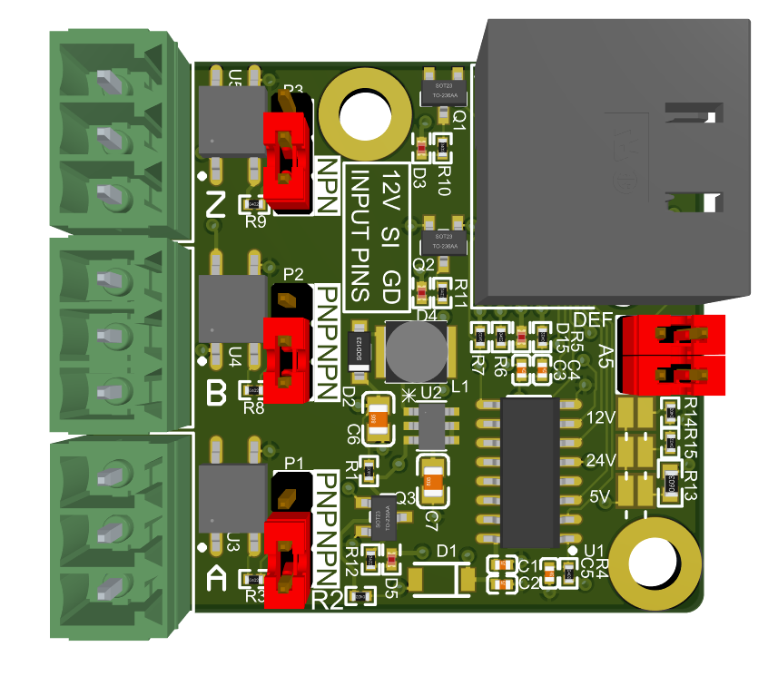

### Encoder Breakout MK2

The encoder breakout board allows you to use the encoder inputs as auxilliary opto-coupled inputs.  The pinout matches the 3 pin inputs of the FlexiHAL.  By default the inputs are powered with 12V and can be used with either NPN or PNP sensors or switches by setting the jumpers.  By removing R2 and soldering the appropriate bridghes on the right side of the board you can also power the inputs with 5V, 12V or 24V.

The default jumper locations are shown below.  This sets all inputs to NPN and uses the default RJ45 pinout:

To use the Encoder BOB MK2 with A5 or earlier boards, you need to rotate the 2 jumpers next to the RJ45 jack so that they are vertical instead of horizontal in the above image.
